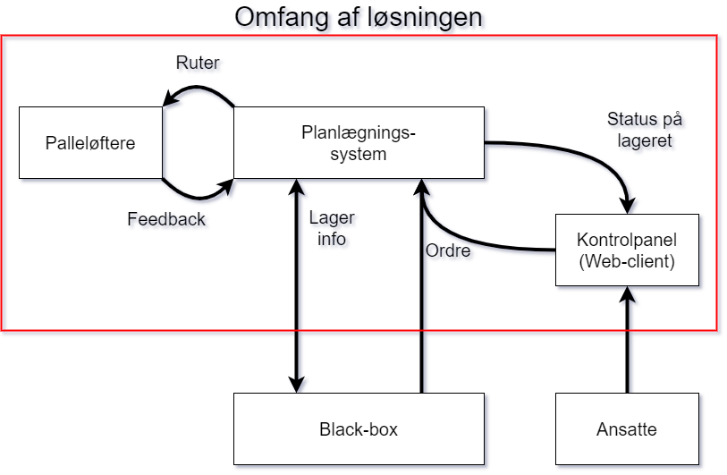
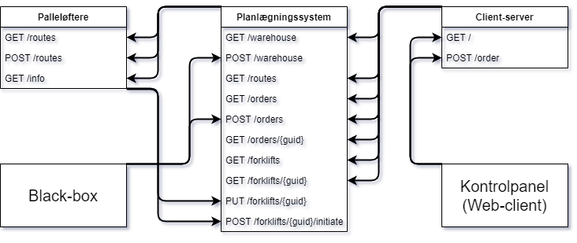

# P2

## Projektets struktur 
Projektets kildekode er inddelt i fem hovedmapper: **blackBox**, **forklifts**, **planningScheduler**, **webClient** og **shared**.
Derudover, findes der to hjælpemapper kaldet **docs** og **test**. 

Hovedmappernes indhold:
- [blackBox](./src/blackBox/)
- [forklifts](./src/forklifts/)
- [planningScheduler](./src/planningScheduler/)
- [webClient](./src/webClient/)
- [shared](./src/shared/)

Hjælpemappernes indhold:
- [test](./test/)
- [docs](./docs/)

---

## Model


## Use-case diagram


## Tidsplan
```
Uge 11-12:    Planlægning af programmering

Uge - 13      Planlægning af programmering

  Mandag: Swagger API Dokumentation

  Tirsdag: Klassediagrammer (UML)

  Onsdag: Opstart af server

  Torsdag: Viderearbejde på server

  Fredag: Test environment

Uge 14-17:    Programmering

   Uge 14: (kommunikation, storage classes og testmiljø)
      Mandag: hængeparti fra fredag: omskriv funktion til klasse & Use-case diagram & Storage classes
      Tirsdag: Unit Testing. Opsæt testmiljø & Send materiale til Rasmus
      Onsdag:  Test & Kode
      Torsdag: Opsæt klienter til kommunikation
      Fredag: 
    
    Uge 15: Internet
      Mandag:  Parsere og Web (Blackbox og Sockets)
      Tirsdag: Sockets
      Onsdag:  Buffer (Test kommunikationer)
      Torsdag: Implementation af MAPF (A*-implementation) 

    Uge 16: Dokumentation og front end
      Mandag:  Dokumentation
      Tirsdag: Doxygen-dokumentation af kode
      Onsdag:  Doxygen-dokumentation af kode
      Torsdag: Dokumentation til rapport
      Fredag:  Dokumentation

    Uge 17: Mapf og front end
      Mandag:  kollision
      Tirsdag: binary search og insert af scheduleitems
      Onsdag:  kollision og a* på et routeset
      Torsdag: a* på et routeset
      Fredag:  a* på et routeset

Uge 18:       Bufferperiode (mapf og rapportskrivning)
  Mandag: Planlægge hele af routeset
  Tirsdag: Teste routeset planlægning og måske priority searching
  Onsdag:  priority searching
  Torsdag: bug-fixing
  Fredag:  bug-fixing

Uge 19:       Test
  Mandag: bug-fixing
  Tirsdag: ?
  Onsdag:  ?
  Torsdag: ?
  Fredag:  ?

Uge 20 - 21:  Rapportskrivning

Uge 22:       AFLERVERING!
```
