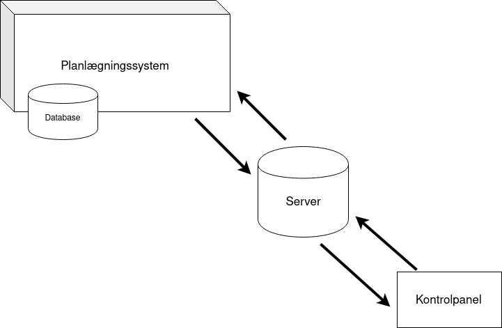

#  Kontrolpanel (Webinterface)

Kontrolpanelet har sin egen server.



## Kontrolpanelet skal modtage følgende fra planlægningssystemet

- ### Grafen
  - #### Låste ruter
- ### Ordrene
- ### Palleløfternes data
  - Placering
  - Strømniveau
  - Kø af ruter

---

## Kontrolpanelet skal sende følgende til planlægningssystemet

- ### Ordre
  - #### Palleplacering
    - Startposistion
    - Slutposition
    - Tidspunkt 
      - *Enten* starttidspunkt *eller* sluttidspunkt.
  - #### Kør til opladning
    - startposition, slutposition 

--- 

## Funktionaliteter

### Graf 

- [Visualisering](http://sigmajs.org/#usecases) af lagert:
  - Fugleperspektiv, der kigger ned på lageret. En to-dimensionel flade, der viser lageret. 

- Hvad skal grafen indeholde?
  - Reoler
  - Kanter og knuder
  - Palleløftere
    - Indikator for 
      - Igangværende ordreudførelse
      - Idle
  - [Visualisering](http://sigmajs.org/#usecases) af "palleløfter highlighting"
    - Markering af en en specifik palleløfter, hvilket skal kunne udløse at der vises data for denne (eks. palleløfterens ruter, tilstand).

### Liste over palleløftere
- En liste over alle palleløftere, hvor der er mugligt at "highligte"/vælge en palleløfter ud fra dens `id`.


### Ordrefremsendelse
En ordre er "palleuafhængig", forstået på den måde at når en ordre angives, så betyder det at der er en palle på den specificerede startknude. 
**Antagelse**: vedkommende der benytter denne funktion har kendskab til lageret.

- #### En ordre skal specificeres.
  - ##### Dette gøres ved at angive:
    - Startposition
    - Slutposition
    - Tidspunkt
        - *Enten* starttidspunkt *eller* sluttidspunkt.

```javascript
// data der skal sendes
order = {
    startPos    : "vertice",
    endPos      : "vertice",
    time        : "epoch time", 
    isStartTime : "true/false" 
};

```


- #### En ordre skal sendes

Ud fra den angivede information oversætter planlægningssytemet en ordre til en rute. 

--- 

## "Sketch" for graf-delen af kontrolpanelet


## UI

- Grafen: 
    - Her vises den nuværnede placering af alle palleløftere.
    - En udvalgt rute kan vises.

- Panel:
  - Palleløftere (dette er en liste): 
    - Skal have sin egen scrollbar, som skal holde sig indenfor skærmen.
    - Information om en palleløfter:
      - En palleløfters nuværende rute vises på grafen.
      - For hver palleløfter er dens ruter synlig i en liste og ruterne står i prioriteret rækkefølge, prioriteret efter rækkefølgen de skal udføres i.
      - Position.
      - Batteristatus.
      - Palleløfterstatus (instructionType).

  - Ordrer:
    - Afventende ordrer.
    - Aktive ordrer.
    - (Udførte ordrer: disse vil ikke blive vist).
    - For hver ordre vises information om denne:
        - Startplacering. 
        - Slutplacering.
        - Enten starttidspunkt eller sluttidspunkt alt efter hvad `timeType` viser.
        - ForkliftId.
        - PalletId.
        - (nice-to-have: start- og slutplacering kan markeres på grafen)
    - Mulighed for tilføjelse af en ordre via. en form.

---

# Front end kan deles op i

## Det visuelle

## Informationsflow

